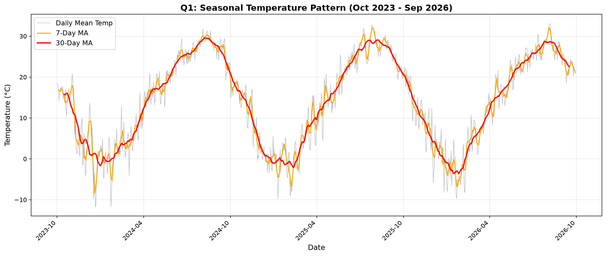
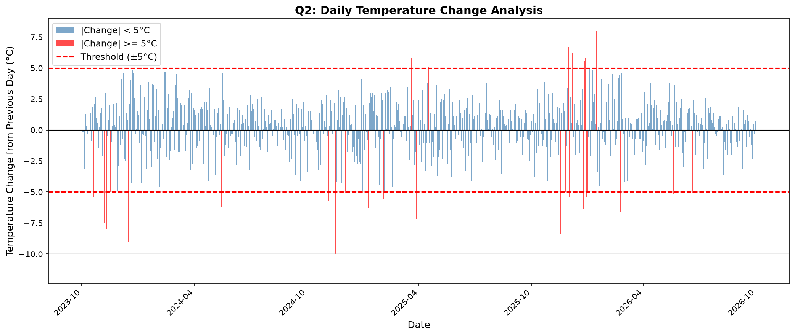
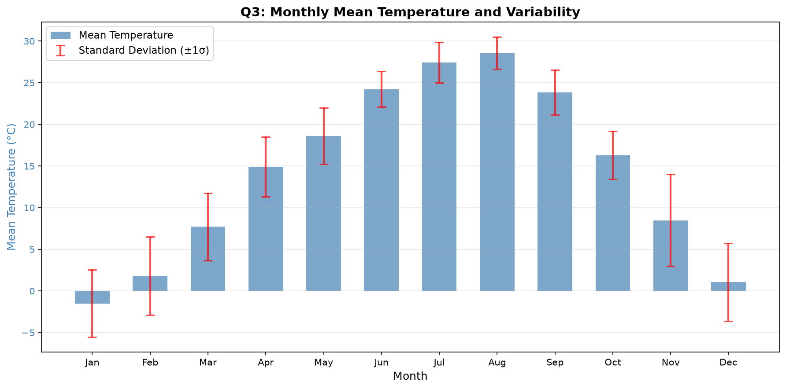

# 서울 최근 3년 일평균기온의 계절 패턴과 급격한 기온 변화 분석

## 1. 분석 주제와 목적

서울의 최근 3년 일평균기온 데이터를 분석하여 계절 패턴과 단기 기온 변화를 살펴본다. 코디세이 AI 응용 M1 「AI 데이터 분석: 데이터 기반 트렌드 분석」 프로젝트의 분석 결과를 정리한 보고서다.

이 분석의 목적은 최근 3년 동안 관찰된 기온의 특징을 숫자와 그래프로 확인하는 것이다. 장기적인 기후변화를 증명하려는 분석은 아니다.

## 2. 분석 질문

- Q1. 최근 3년 서울의 일평균기온에는 어떤 계절적 패턴이 반복되는가?
- Q2. 전날과 비교해 기온이 급격하게 변한 날은 언제였는가?
- Q3. 월별 평균기온과 기온 변동성은 어떻게 다른가?

## 3. 데이터

| 항목 | 내용 |
|---|---|
| 출처 | 기상청 기상자료개방포털 종관기상관측(ASOS) |
| 관측지점 | 서울(108) |
| 기간 | 2023-10-01 ~ 2026-09-30 |
| 데이터 수 | 1,096일 |
| 사용 컬럼 | 일시, 평균기온(°C) |
| 원본 CSV 인코딩 | EUC-KR |
| 데이터 파일 | `data/seoul_daily_temperature_2023_2026.csv` |

## 4. 데이터 품질 확인 및 전처리

데이터를 확인한 결과, 결측치 0개, 중복 날짜 0개, 분석 기간 내 누락 날짜 0개였다. 실제 일평균기온의 범위는 **-11.7°C ~ 33.1°C**였다.

IQR은 전체 기온을 크기순으로 놓았을 때 가운데 50%가 차지하는 범위다. 이 범위를 이용해 통계적 이상치 후보를 확인했다.

| IQR 검사 항목 | 값 |
|---|---:|
| Q1: 25백분위수 | 4.88°C |
| Q3: 75백분위수 | 24.00°C |
| IQR: Q3 − Q1 | 19.12°C |
| 하한: Q1 − 1.5 × IQR | -23.81°C |
| 상한: Q3 + 1.5 × IQR | 52.69°C |
| 통계적 이상치 후보 | 0개 |

표의 Q1과 Q3는 사분위수를 뜻하며, 분석 질문 번호와는 별개다. 각 수치는 원래 계산값을 소수점 둘째 자리까지 반올림했다.

IQR 검사는 통계적 이상치 후보를 찾기 위한 확인 방법이다. 기상 관측의 실제 극값을 무조건 제거하기 위한 기준은 아니다. 이번 분석에서 삭제하거나 보정한 데이터는 없다.

일시를 날짜형으로 변환하고 날짜순으로 정렬한 뒤, 연도와 월, 이동평균, 전일 대비 변화량을 추가했다.

## 5. 분석 방법

1. **7일 이동평균:** 해당 날짜를 중심으로 7일의 기온을 평균하여 짧은 기간의 흐름을 확인했다.
2. **30일 이동평균:** 해당 날짜를 중심으로 30일의 기온을 평균하여 더 긴 기간의 흐름을 확인했다. 이동평균은 필요한 날짜 수가 확보되는 구간에서만 계산했다.
3. **전일 대비 평균기온 변화량:** 오늘의 일평균기온에서 전날의 일평균기온을 뺐다. 양수는 상승, 음수는 하락을 뜻한다. 첫날은 비교할 전날이 없어 변화량 계산에서 제외된다.
4. **월별 평균:** 3년 전체 데이터를 연도 구분 없이 1월~12월로 묶어 각 월의 일평균기온을 평균했다.
5. **월별 표준편차:** 같은 방식으로 묶은 각 월의 일평균기온이 월별 평균 주변에 얼마나 퍼져 있는지 계산했다. 값이 클수록 기온의 퍼짐이 크다. 기존 코드의 pandas 표본 표준편차(`ddof=1`)를 사용했다.

급격한 기온 변화는 **전일 대비 평균기온 변화량의 절대값이 5.0°C 이상인 경우**로 정했다. 절대 변화량의 95백분위수가 약 **4.93°C**였으므로, 이를 참고하여 분석 편의를 위해 5°C를 기준으로 설정했다. 이 기준은 이 데이터에 사용하는 분석용 기준이며, 일반적인 기상학의 공식 극단기온 기준을 뜻하지 않는다.

## 6. 시각화 및 결과

### 6.1 Q1 계절 패턴

그래프에서는 겨울에 기온이 낮아지고 여름에 높아지는 약 1년 주기의 상승·하락 패턴이 분석 기간 동안 **3회** 관찰된다.

3년 전체를 1월~12월로 묶은 월별 평균기온 중 가장 높은 달은 **8월 28.56°C**, 가장 낮은 달은 **1월 -1.51°C**였다. 두 달의 평균기온 차이는 **30.07°C**였다. 이는 분석 기간에 반복되는 계절별 기온 차이를 보여주는 관찰 결과다.

### 6.2 Q2 급격한 기온 변화

유효한 전일 대비 변화량은 **1,095개**였다. 이 중 **|변화량| ≥ 5.0°C**인 날짜는 **55일**, 비율은 **5.02%**였다. 그래프의 강조 표시는 상승과 하락 모두에 동일한 절대값 기준을 적용한다.

- 최대 하락: **2023-11-24, -11.4°C**
- 최대 상승: **2026-01-15, +8.0°C**

절대 변화량이 큰 순서의 상위 5개 날짜는 다음과 같다.

| 순위 | 날짜 | 전일 대비 평균기온 변화량 |
|---|---|---:|
| 1 | 2023-11-24 | -11.4°C |
| 2 | 2024-01-22 | -10.4°C |
| 3 | 2024-11-17 | -10.0°C |
| 4 | 2026-02-06 | -9.6°C |
| 5 | 2023-12-16 | -9.0°C |

이 날짜들은 전날과의 기온 차이가 컸던 날이다. 변화가 발생한 기상학적 원인은 이번 분석에서 확인하지 않았다.

### 6.3 Q3 월별 평균기온과 변동성

막대는 월별 평균기온, 오차 막대는 평균을 중심으로 한 **±1 표준편차**를 나타낸다. 월별 표준편차는 3년 전체 데이터를 연도 구분 없이 1월~12월로 묶어 계산했다.

| 항목 | 결과 |
|---|---:|
| 표준편차가 가장 큰 달 | 11월, 약 5.53°C |
| 표준편차가 가장 작은 달 | 8월, 약 1.94°C |
| 두 표준편차의 차이 | 3.58°C |
| 11월 평균기온 | 8.48°C |

표준편차 차이는 반올림 전의 원래 계산값을 뺀 뒤 소수점 둘째 자리까지 반올림했다. 따라서 표시된 5.53과 1.94를 직접 뺀 값과는 차이가 있다.

평균기온이 가장 높은 8월의 표준편차는 가장 작았다. 반면 11월의 평균기온은 8.48°C였고 표준편차는 가장 컸다. 평균 수준과 기온의 퍼짐은 서로 다른 특성임을 확인할 수 있다. 월별 표준편차는 전일 대비 변화량의 크기를 직접 나타내는 지표는 아니다.

## 7. 핵심 인사이트

1. **계절에 따른 상승·하락 패턴이 반복됐다.** 그래프에서 약 1년 주기의 패턴이 3회 관찰됐고, 월별 평균기온은 8월 28.56°C와 1월 -1.51°C 사이에 30.07°C의 차이가 있었다. 분석 기간의 계절 패턴을 확인할 수 있지만, 이 결과만으로 장기 기후변화 추세를 판단할 수는 없다.
2. **일부 날짜에서는 전날과의 기온 차이가 크게 나타났다.** 유효 변화량 1,095개 중 절대 변화량이 5.0°C 이상인 날짜는 55일로 5.02%였다. 최대 하락은 -11.4°C, 최대 상승은 +8.0°C였다. 이는 설정한 분석용 기준에 따라 단기 변화가 큰 날짜를 구분한 결과이며, 변화의 원인을 설명하지는 않는다.
3. **평균기온이 높은 달과 기온의 퍼짐이 큰 달은 달랐다.** 평균기온이 가장 높은 8월은 표준편차가 약 1.94°C로 가장 작았고, 평균기온이 8.48°C인 11월은 표준편차가 약 5.53°C로 가장 컸다. 표준편차 차이는 3.58°C였다. 평균은 기온의 수준을, 표준편차는 평균 주변의 퍼짐을 보여주므로 두 지표를 함께 살펴볼 필요가 있다.

## 8. 결론

Q1에서는 약 1년 주기의 계절 패턴이 3회 관찰됐으며, 월별 평균기온은 8월에 가장 높고 1월에 가장 낮았다. Q2에서는 절대 변화량 5.0°C 이상인 날이 55일 확인됐고, 가장 큰 하락과 상승은 각각 2023-11-24와 2026-01-15에 나타났다. Q3에서는 월별 표준편차가 11월에 가장 크고 8월에 가장 작아, 평균기온의 수준과 변동성이 서로 다른 특성임을 확인했다.

이 결과는 최근 3년 서울 관측자료에서 직접 확인한 패턴과 숫자에 대한 설명이며, 기온 변화의 원인을 밝힌 결과는 아니다.

## 9. 한계

- 분석 기간이 3년으로 짧아 장기 기후변화 추세를 판단할 수 없다.
- 서울(108) 한 관측지점만 사용했으므로 다른 지역의 특성을 설명할 수 없다.
- 기온 변화의 원인을 설명하는 기압, 강수, 풍속 등 다른 기상변수는 분석하지 않았다.
- 5°C 기준은 이 데이터의 분포를 참고하여 설정한 분석용 기준이다.
